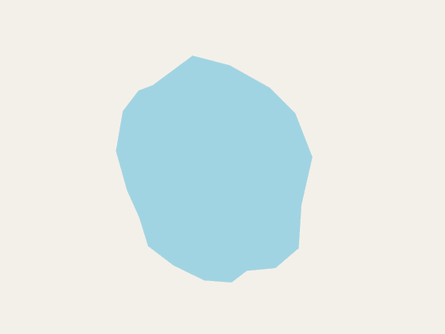

# route-planner
Построение маршрутов

# Пример запроса:

```
POST http://localhost:8000/route
{
    "topLeftPoint": {
        "lat": 63.9391,
        "lon": 50.6874
    },
    "botRightPoint": {
        "lat": 63.9454,
        "lon": 50.7074
    },
    "beginPoint": {
        "lat": 63.9400,
        "lon": 50.6880
    },
    "endPoint": {
        "lat": 63.9450,
        "lon": 50.7070
    }
}
```