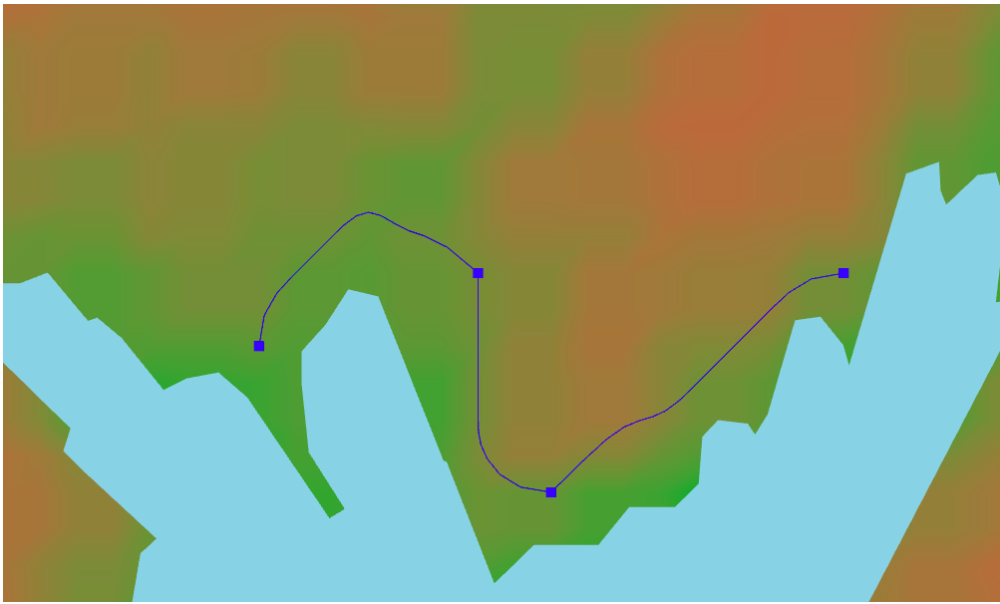

# route-planner
route-planner is simple web application for building routes based on terrain and geographical heights.

## How to use:
To start the server, you need to install Go. You can download it from the [link](https://go.dev/doc/install)

Then run the command and the server will start working:
```
git clone https://github.com/Fkhalilullin/route-planner.git
cd route-planner/backend
make run
```
If you need a binary file, you can use the command:
```
make build
./route-planner
```
After starting the server, open the file in the browser:
```
cd route-planner/frontend/src/html/index.htlm
```

## Examples:




Enjoy!