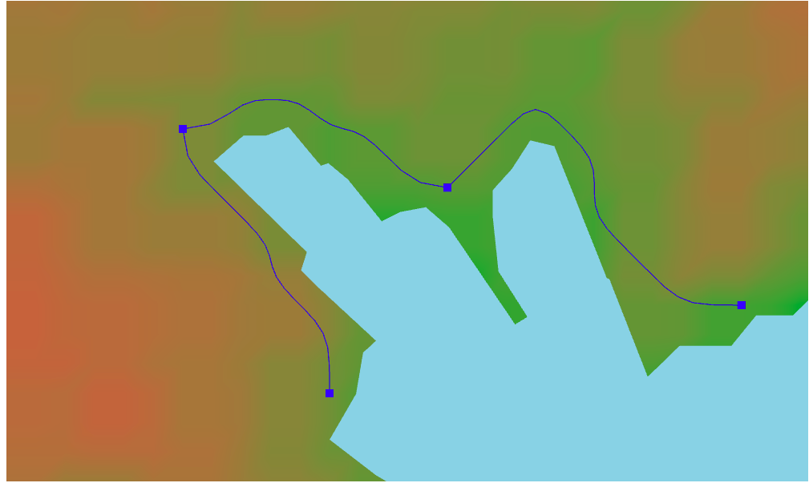

# route-planner
route-planner is simple web application for building routes based on terrain and geographical heights.

## How to use:
To start the server, you need to install Go. You can download it from the [link](https://go.dev/doc/install)

Then run the command and the server will start working:
```
git clone https://github.com/Fkhalilullin/route-planner.git
cd route-planner/backend
make run
```
If you need a binary file, you can use the command:
```
make build
./route-planner
```
After starting the server, open the file in the browser:
```
cd route-planner/frontend/src/html/index.htlm
```

## Elevation API
The [open-elevation](https://open-elevation.com/) api is used to calculate heights. At the moment, the free api does not work. Therefore, before launching the project, it is necessary to deploy the open-elevation server for correct operation

You can see how to do this in the [documentation](https://github.com/Jorl17/open-elevation/blob/master/docs/host-your-own.md)

connecting between the free api and the local api you can change the value of the `UseLocalHost = true` field in the `config.go` file

## Examples:




Enjoy!